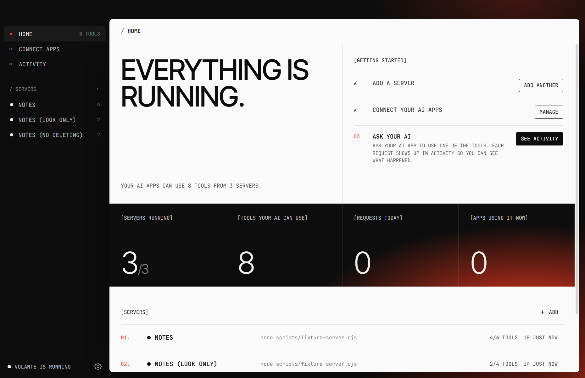

# Volante

**One private hub between your AI apps and your tools.**

Volante is a Windows desktop app that runs a single [MCP](https://modelcontextprotocol.io) endpoint on your computer. Add your MCP servers (Webflow, GitHub, a browser, your files…) to Volante once, connect your AI apps (Claude Code, Claude Desktop, Cursor, VS Code and others) to Volante once, and every app can use every server, with the permissions you choose.



## What it does

- **Any MCP server.** Local commands, remote Streamable HTTP or SSE servers. Servers that use OAuth sign in through your browser.
- **Several Webflow workspaces.** Add each workspace by name; each gets its own sign-in, its own tool prefix and its own permissions, so your AI always knows which workspace it is working in.
- **Permissions per server.** *Allow everything*, *Look only*, *No deleting* or *Choose tools*, with a switch per tool on top. Tools are tagged as reads, changes or deletes, from the server's own annotations or, failing that, from the tool name.
- **No name clashes.** Tools are prefixed per server (`webflow_acme__list_sites`, `github__create_issue`).
- **One-click connect** for Claude Code, Claude Desktop, Cursor, VS Code, Windsurf, Gemini CLI and Codex, plus import of the servers those apps already have. Each app's config file is backed up (`*.volante.bak`) before its first edit.
- **Activity log** of every request: arguments, result, duration and which app asked.
- **Stays out of the way.** Lives in the system tray, can start with Windows, and the stdio bridge starts it on demand for apps that launch MCP servers as processes.

## Security

- Listens on `127.0.0.1` only, behind a bearer token, and rejects requests with a foreign `Host` or `Origin` header.
- Environment variables, headers and OAuth tokens are encrypted at rest with Windows DPAPI.
- Nothing is sent anywhere except to the MCP servers you add.

## Install

Download the latest installer from the Releases page and run it. The installer is not code-signed yet, so Windows SmartScreen may warn the first time: choose **More info → Run anyway**.

Settings live in `%APPDATA%\Volante`.

## Build from source

Requires Node.js 22+ on Windows.

```bash
npm install
npm run dev
```

| Command | What it does |
| --- | --- |
| `npm run dev` | Run with live reload |
| `npm run typecheck` | Type-check the main process and the UI |
| `npm run build` | Bundle into `out/` |
| `npm run dist` | Build the Windows installer into `release/` |
| `npm run icons` | Re-render the app and tray icons |

`ROUTER_DATA_DIR=<folder>` runs against a separate config folder, which is handy for testing. `scripts/smoke-test.cjs` checks a running instance end to end against `scripts/fixture-server.cjs`.

## How apps connect

| App | Transport |
| --- | --- |
| Claude Code, Cursor, VS Code, Windsurf, Gemini CLI | Streamable HTTP to `http://127.0.0.1:47900/mcp` with `Authorization: Bearer <token>` |
| Claude Desktop, Codex | Volante's own executable in Node mode as a stdio bridge (`out/main/bridge.js`) |

## Credits

Built with [Electron](https://www.electronjs.org), [React](https://react.dev), the [MCP TypeScript SDK](https://github.com/modelcontextprotocol/typescript-sdk) and [Iconoir](https://iconoir.com) icons.

Fonts: [Inter Tight](https://github.com/rsms/inter-tight) and [JetBrains Mono](https://github.com/JetBrains/JetBrainsMono), bundled under the SIL Open Font License 1.1 (see `src/renderer/src/fonts/`).

## License

[MIT](LICENSE) © BE Aesthetics
